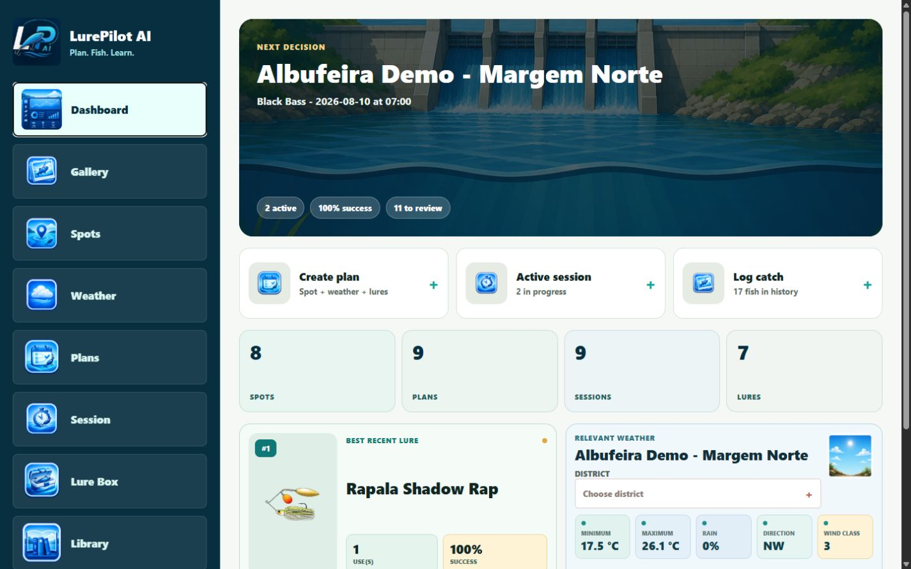
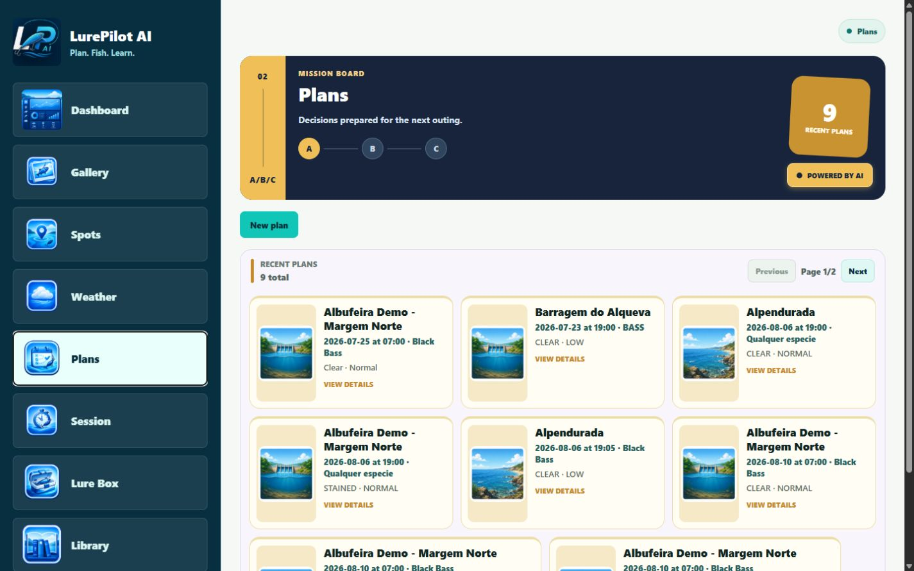
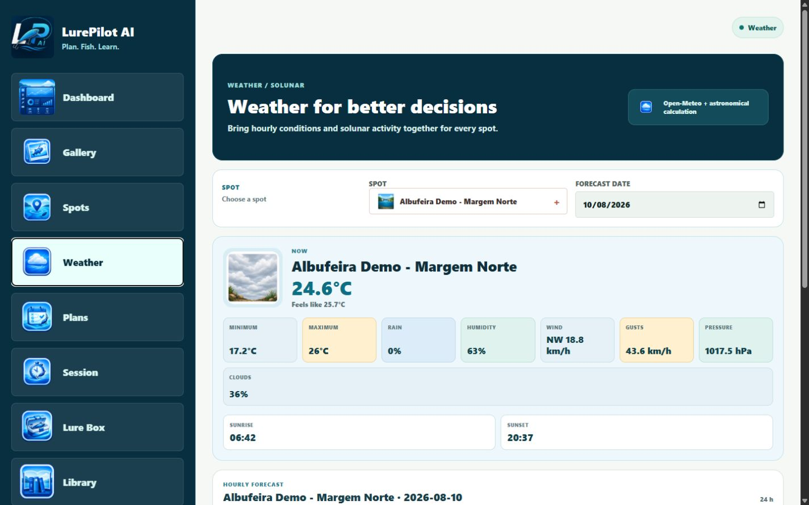
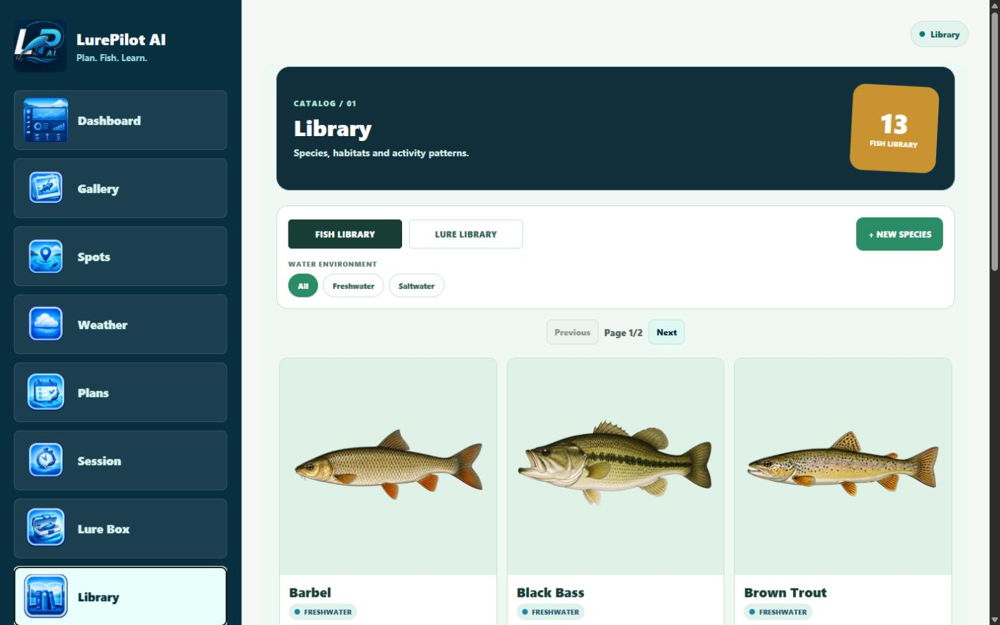
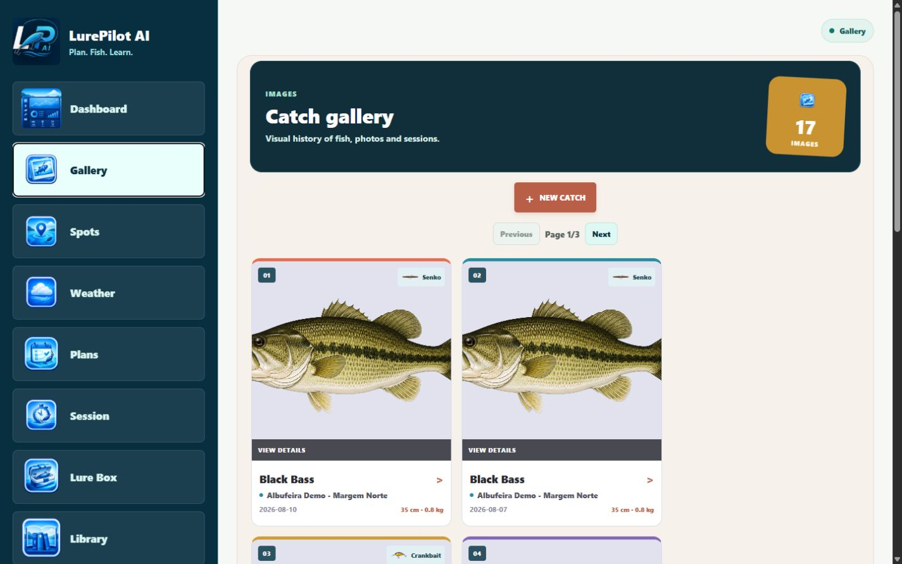
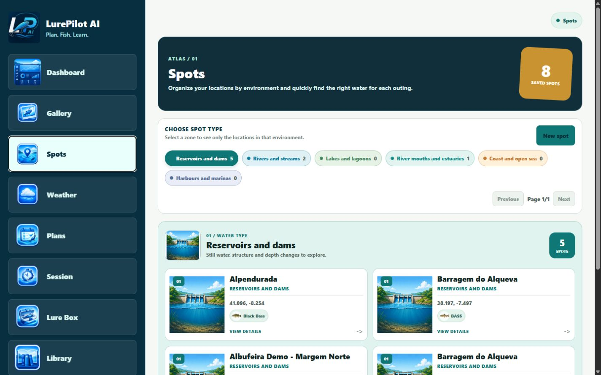
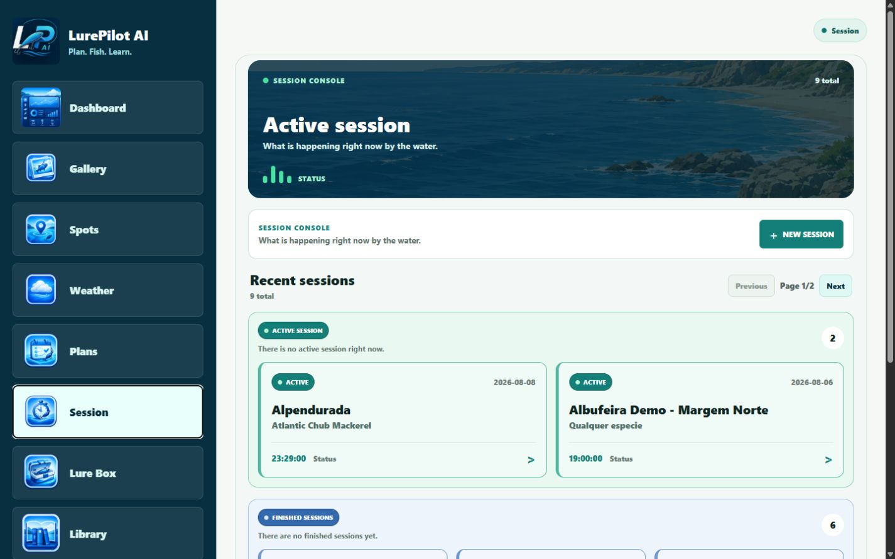
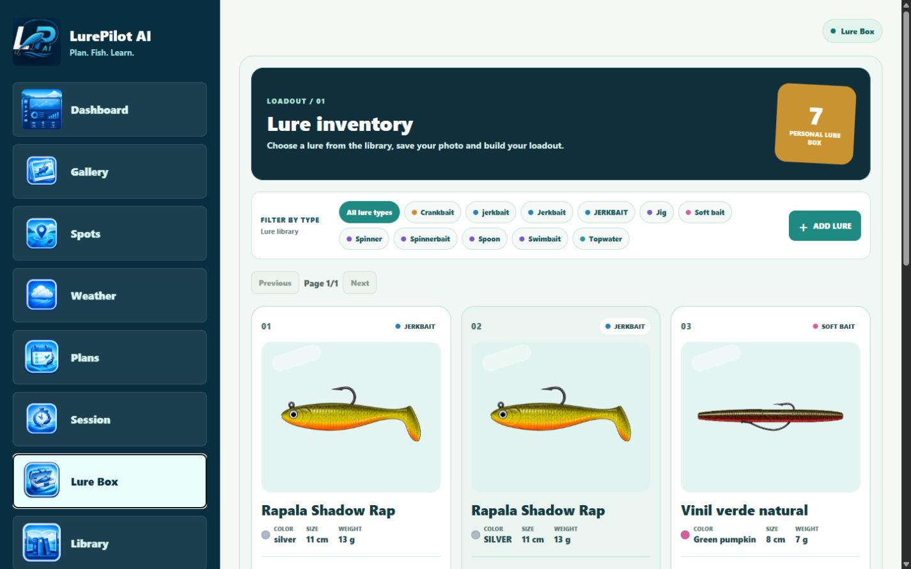

<p align="center">
  
</p>

<h1 align="center">LurePilot AI</h1>

<p align="center">
  A local AI fishing copilot that helps plan, adapt and learn from every fishing session.
</p>

<p align="center">
  <strong>Plan -> Fish -> Capture -> Learn</strong>
</p>

<p align="center">
  Java 21 | Spring Boot | React Native Web | PostgreSQL | Docker | LM Studio
</p>

<p align="center">
  
</p>

## Overview

LurePilot AI is a local-first fishing copilot built around a practical decision loop. It combines structured fishing history, weather, Solunar data, lure knowledge and a local LLM to help a recreational angler make better decisions before and during a session.

This is not a generic chatbot and not only a fishing diary. The application prepares structured context in the backend, asks the local model for a practical A/B/C strategy, validates the result, and stores the outcome so future recommendations can be evaluated against real results.

## Why This Project Stands Out

- **Real domain problem:** spots, species, lure inventory, weather, sessions, catches and outcomes form one coherent product.
- **Useful local AI:** LM Studio provides recommendations without sending private fishing history to a cloud provider.
- **End-to-end product flow:** plan a session, consult conditions, fish, register a catch, review the recommendation and learn from history.
- **Backend-first engineering:** layered MVC architecture, DTO contracts, validation, persistence, migrations, integration clients and operational scripts.
- **Frontend with product intent:** React Native Web screens are designed for repeated use on desktop and iPhone Safari, with direct navigation between plans, sessions and the catch gallery.

## Product Flow

```text
Create plan
    |
    +--> Spot + species + selected lures + weather + Solunar
    |
    +--> Local AI Planner creates and validates plan A/B/C
    |
Start session
    |
    +--> Adjust strategy when conditions change
    |
    +--> Register catches with photos, species and lure used
    |
Finish session
    |
    +--> Review recommendation, execution and result
    |
    +--> Gallery, analytics and confidence feedback
```

## Current Experience

<table>
  <tr>
    <td width="50%">
      
      <p align="center"><strong>Plans and AI Planner</strong><br />A/B/C planning with local AI context.</p>
    </td>
    <td width="50%">
      
      <p align="center"><strong>Weather and Solunar</strong><br />Current conditions, forecast and activity windows.</p>
    </td>
  </tr>
  <tr>
    <td width="50%">
      
      <p align="center"><strong>Fish and Lure Library</strong><br />Visual catalogues with editable domain data.</p>
    </td>
    <td width="50%">
      
      <p align="center"><strong>Catch Gallery</strong><br />Photo-first history connected to sessions and spots.</p>
    </td>
  </tr>
  <tr>
    <td width="50%">
      
      <p align="center"><strong>Fishing Spots</strong><br />Map-based location selection with species and water context.</p>
    </td>
    <td width="50%">
      
      <p align="center"><strong>Fishing Sessions</strong><br />Active sessions, catches, results and duration tracking.</p>
    </td>
  </tr>
  <tr>
    <td width="50%">
      
      <p align="center"><strong>Personal Lure Box</strong><br />An inventory-style space for the user's own lures.</p>
    </td>
    <td width="50%">
      
      <p align="center"><strong>Command Dashboard</strong><br />The main operational view for the next fishing decision.</p>
    </td>
  </tr>
</table>

## What Is Implemented

### Fishing domain

- Fishing spots with water type, spot type, coordinates and multiple target species.
- Zoomable and draggable OpenStreetMap picker for selecting coordinates.
- Fish library with freshwater/saltwater classification, habitat, activity, strike zones and favourite lures.
- General lure library with images, difficulty, effectiveness and action guidance.
- Personal Lure Box separated from the general catalogue, with personal photo, colour, size, weight and library link.
- Fishing plans with date/time selectors, any-species mode, multiple target species and selected lures or the full Lure Box.
- Fishing sessions with active and finished workflows, calculated duration, result and rating.
- Catch registration with species, lure, size, optional weight, session and photo.
- Gallery with create, edit, delete and navigation back to the related session.

### Weather, Solunar and AI

- Open-Meteo integration with current, daily and hourly weather data.
- Searchable Portuguese forecast locations and coordinate-based snapshots.
- Solunar forecast calculated from spot coordinates and selected date.
- Local LM Studio integration through an OpenAI-compatible API.
- Structured AI context containing spot, species, lures, weather, Solunar and relevant history.
- Plan A/B/C recommendations, lure ranking, warnings and confidence.
- Validation that removes or warns about lures outside the selected context.
- Recommendation save/version history, execution tracking, session adjustments and final review.

### Dashboard and learning loop

- Next planned session and active session shortcuts.
- Weather and Solunar panels linked to the selected district/location.
- Latest catch with photo priority.
- Recent lure performance and practical insights.
- Analytics for top lures, best spots, best conditions and recommendation performance.
- Confidence System informed by weather, spot, history, selected lures, missing context and outcomes.

## Engineering Highlights

### Layered backend architecture

```text
React Native Web / Vite
          |
       HTTP/JSON
          v
Spring Boot Controllers -> Services -> Repositories
          |                    |
       DTOs               JPA Entities
          |                    |
          +------ PostgreSQL -+
          |
          +------ Open-Meteo
          |
          +------ LM Studio / qwen2.5-7b-instruct
```

The backend follows a strict layered MVC design:

- Controllers handle HTTP requests and responses only.
- Services contain business rules and orchestration.
- Repositories handle persistence and database queries.
- DTOs define request/response contracts.
- Entities are never exposed directly by the API.
- Flyway migrations control schema changes and indexes.

### Local AI with controlled context

The LLM is not treated as the source of truth. The backend builds the context, limits the hourly forecast to the most relevant hours, constrains recommendations to available lures, validates free-text plan A/B/C output, and stores warnings when the model needs correction.

The current model is:

```text
qwen2.5-7b-instruct
```

LM Studio runs locally at `http://localhost:1234/v1` when the backend runs directly on Windows. The backend uses `host.docker.internal` when running inside Docker.

### User photo storage

Catch photos are uploaded as multipart files, validated by type and size, stored outside the frontend bundle and referenced through URLs. The upload directory is configurable through `LUREPILOT_UPLOADS_DIRECTORY`, so production deployment can mount persistent storage without changing the domain model.

## Stack

| Layer | Technology |
| --- | --- |
| Backend | Java 21, Spring Boot, Spring Web, Spring Data JPA |
| Database | PostgreSQL, Flyway |
| Frontend | React Native Web, React, Vite, Axios, React Router |
| AI | LM Studio, OpenAI-compatible API, qwen2.5-7b-instruct |
| Weather | Open-Meteo |
| Mapping | OpenStreetMap picker |
| Infrastructure | Docker Compose |
| Local access | Tailscale VPN, Safari on iPhone |

## Project Structure

```text
backend/
  src/main/java/com/lurepilot/backend/
    controller/
    service/
    repository/
    model/
    dto/
    config/
    client/
  src/main/resources/
    db/migration/
frontend/
  src/App.jsx
  assets/images/
    brand/
    fish/freshwater/
    fish/saltwater/
    lures/
    lure-actions/
    lure-action-icons/
    spots/
    ui/
    weather/
scripts/
  start-local.ps1
  stop-local.ps1
  open-local-app.ps1
  install-desktop-shortcut.ps1
  backup-local.ps1
  allow-firewall.ps1
docs/
  FishLog_AI_Project_Specification.docx
  LurePilot_AI.postman_collection.json
  screenshots/
```

## Run Locally

### Prerequisites

- Java 21
- Node.js and npm
- Docker Desktop
- LM Studio with `qwen2.5-7b-instruct`

### One-click startup on Windows

Install the Desktop shortcut once:

```powershell
cd "C:\Users\João Rocha\Documents\lurepilot-ai"
.\scripts\install-desktop-shortcut.ps1
```

Then:

1. Open LM Studio, load `qwen2.5-7b-instruct` and start its local server.
2. Confirm Tailscale is connected if using the iPhone.
3. Double-click **LurePilot AI** on the Desktop.
4. Open `http://localhost:5173` on the computer or the Tailscale URL on the iPhone.

The shortcut starts Docker/PostgreSQL, backend and frontend, waits for the health check and opens the browser. It does not load the LM Studio model automatically.

### Manual startup

```powershell
docker compose up -d

cd backend
./mvnw spring-boot:run

cd ..\frontend
npm install
npm run dev
```

The application is available at:

```text
http://localhost:5173
```

Health check:

```text
http://localhost:8080/api/health
```

### iPhone through Tailscale

Install [Tailscale](https://tailscale.com/download/) on the computer and iPhone using the same account. Allow the frontend port from an elevated PowerShell:

```powershell
.\scripts\allow-firewall.ps1 -RemoteAddress <IPHONE-TAILSCALE-IP>
```

Then open the computer's Tailscale address in Safari:

```text
http://<COMPUTER-TAILSCALE-IP>:5173
```

Only port `5173` needs to be available to the iPhone. PostgreSQL, backend and LM Studio remain local to the computer. The computer must stay on and connected while the iPhone uses the app.

For browser camera APIs that require a secure context, create a trusted local certificate and start Vite with HTTPS:

```powershell
.\scripts\create-local-cert.ps1 -HostNames @('localhost', '127.0.0.1', '<COMPUTER-TAILSCALE-IP>')
.\scripts\start-local.ps1 -Https
```

## Testing and Quality

Backend tests:

```powershell
cd backend
./mvnw test
```

Frontend checks:

```powershell
cd frontend
npm run lint
npm run build
```

Real local flow with LM Studio:

```powershell
.\scripts\test-local-flow.ps1
```

The end-to-end flow covers plan creation, weather, Solunar, AI recommendation, session adjustment, catch registration, session finish, execution feedback, review, gallery and analytics.

Reliability scenarios include LM Studio unavailable, internet unavailable for Open-Meteo, empty/loading/error states and recovery after a local backup.

## Main API Areas

The complete request collection is available in `docs/LurePilot_AI.postman_collection.json`.

- **Core:** health, dashboard, options.
- **Fishing:** spots, fish library, lure library, Lure Box, plans, sessions, events and catches.
- **Gallery:** catch photo history and uploaded image serving.
- **Weather:** locations, snapshots, current/daily/hourly forecast and Solunar.
- **AI:** plan recommendations, session adjustments, reviews, save/version history and debug output.
- **Tracking:** recommendation execution and session feedback.
- **Analytics:** summary, top lures, best spots, best conditions and recommendation performance.

Selected endpoints:

```text
GET  /api/dashboard
GET  /api/spots
GET  /api/fish
GET  /api/lure-library
GET  /api/lure-box
POST /api/plans
POST /api/recommendations/plan
POST /api/recommendations/session-adjustment
POST /api/sessions/{id}/start
POST /api/sessions/{id}/finish
POST /api/sessions/{id}/catches
GET  /api/gallery/catches
POST /api/uploads/images
GET  /api/solunar/spots/{spotId}
GET  /api/analytics/summary
```

## Local Operations

Stop processes started by the helper:

```powershell
.\scripts\stop-local.ps1
```

Create a database dump and uploads archive:

```powershell
.\scripts\backup-local.ps1
```

Backups are written to `backups/<timestamp>/`. Keep the PostgreSQL dump and uploads archive together. User uploads are excluded from Git and should be backed up independently.

Environment examples are provided at:

```text
.env.example
backend/.env.example
frontend/.env.example
```

## Product Decisions

- The first frontend target is React Native Web; iOS and Android come later from the same React Native direction.
- The app is intentionally single-user for the MVP. Authentication and profiles are postponed.
- Open-Meteo is used for richer coordinate-based weather data; the backend stores snapshots so AI context remains reproducible.
- Solunar is presented as decision support, not a guarantee of a catch.
- Machine learning is not an immediate requirement. The product focuses on local AI, structured history, confidence and practical analytics until real data justifies ML.
- The app remains local-first for now. A future hosted version would need persistent PostgreSQL, photo storage, HTTPS and a secure replacement or tunnel for the local LLM.

## Roadmap

1. Keep validating the complete Plan -> Fish -> Register -> Learn flow with real sessions.
2. Calibrate confidence and recommendation performance using real outcomes.
3. Complete HTTPS/PWA camera support for iPhone Safari.
4. Improve local backup/restore and operational diagnostics.
5. Consider mobile packaging for iOS and Android after the web experience is stable.
6. Re-evaluate ML or web-assisted planning only when the data and product need justify the added complexity.

## Documentation

- [Project specification](docs/FishLog_AI_Project_Specification.docx) - product direction and roadmap source of truth.
- [Postman collection](docs/LurePilot_AI.postman_collection.json) - grouped API requests for manual testing.
- [Local screenshots](docs/screenshots/) - current visual snapshots used in this README.

## Portfolio Summary

> LurePilot AI is a full-stack local fishing copilot built with Java/Spring Boot, React Native Web, PostgreSQL, Docker and LM Studio. It combines structured domain modelling, external weather data, a validated local AI planner, photo-backed session history and outcome tracking in a practical product workflow.
